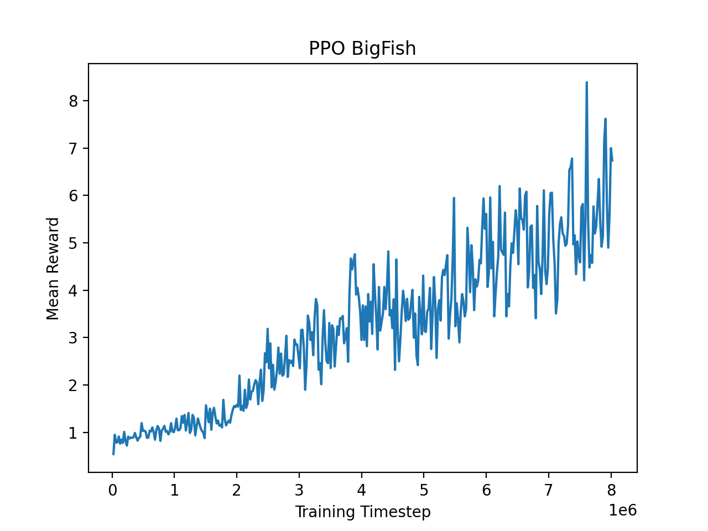
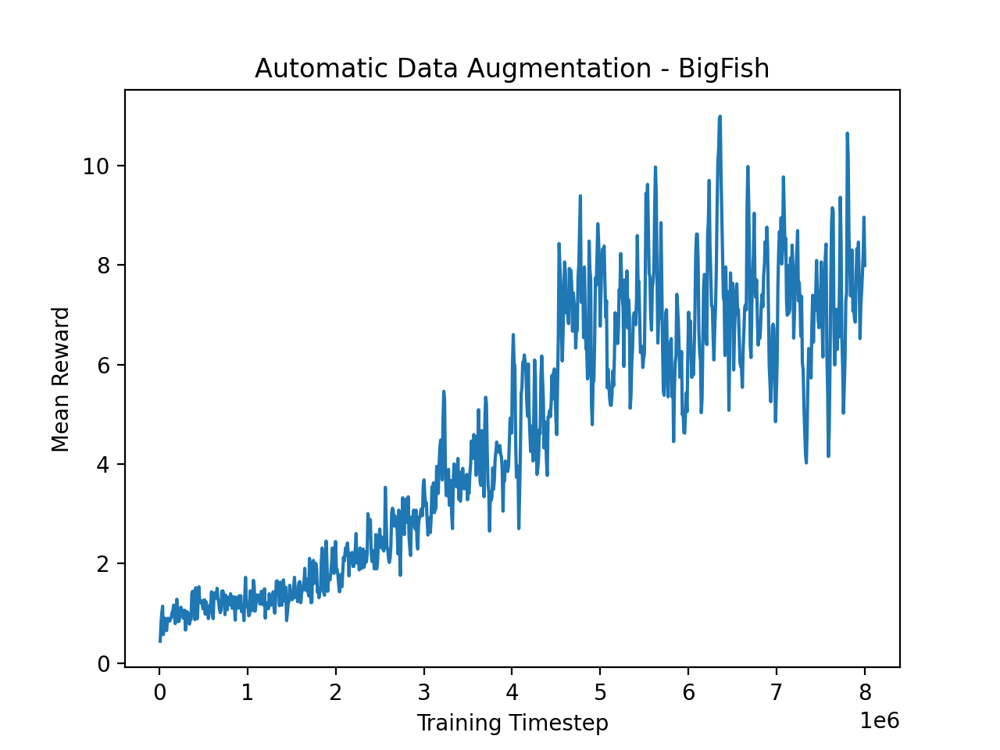
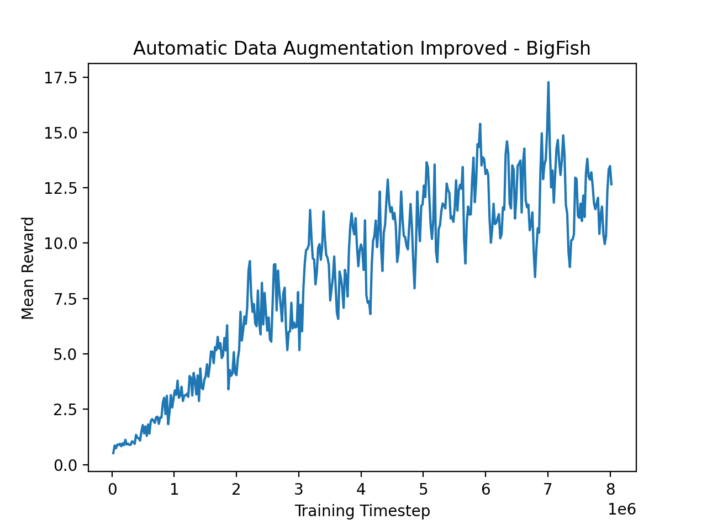
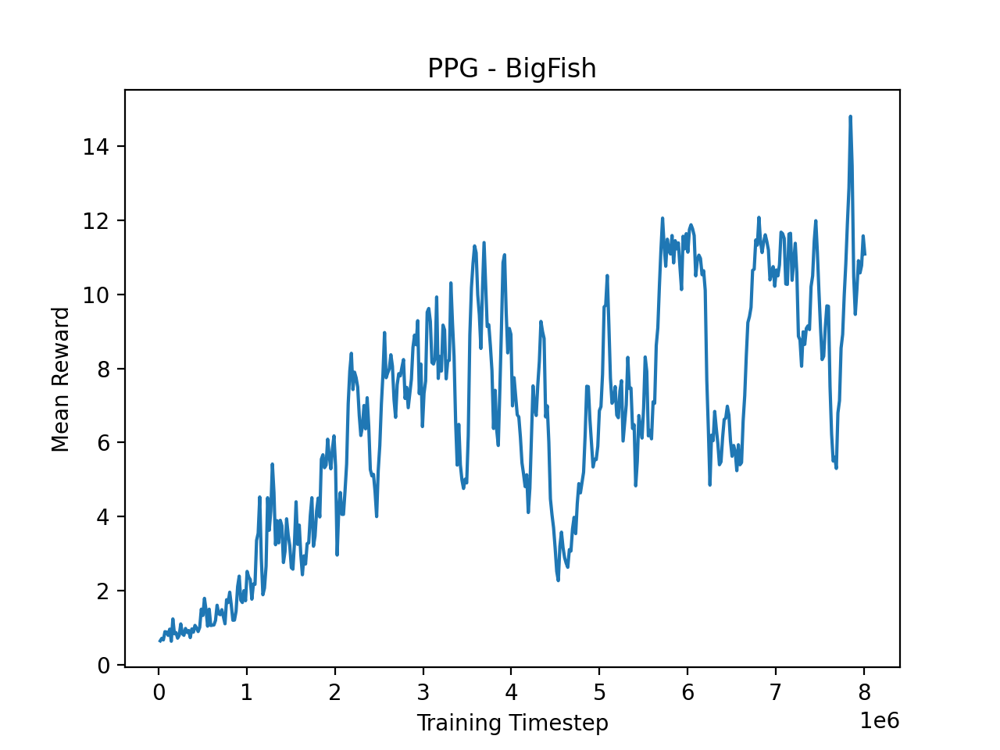

### Original Competition Starter Code: https://github.com/AIcrowd/neurips2020-procgen-starter-kit

# Overview

For this competition, I focused on making large changes to the learning algorithm to improve generalization and sample efficiency on the ProcGen benchmark, instead of tweaking the CNN architecture or tuning hyperparameters. I thought this was the fastest way for me to get better at reinforcement learning, even though it meant ignoring simple and small optimizations that could've increased my score.

For reference, here's how standard PPO performs on the BigFish environment. For this PPO agent, the only changes I made from the starter code were switching Tensorflow to PyTorch and changing the epsilon hyperparameter in the Adam Optimizer (RLLib doesn't use the same value as OpenAI Baselines, and it performed better when I changed it to the OpenAI Baselines value).



## Approach 1: Automatic Data Augmentation

**Code is in the [ucbfinal branch](https://github.com/wkwan/procgen-competition/tree/ucbfinal).** 

**Key changes implemented in:**
[algorithms/ucb_drac_agent/ucb_ppo_policy.py](https://github.com/wkwan/procgen/blob/ucbfinal/algorithms/ucb_drac_agent/ucb_ppo_policy.py) 

My first idea was to add data augmentation on top of the RLLib PPO implementation, since the competition restricts the agent to 8M frames of training on each game. Looking at the results from this paper, [Automatic Data Augmentation for Generalization in Deep Reinforcement Learning](https://arxiv.org/pdf/2006.12862.pdf), it seems that different ProcGen games work best with different data augmentations (although crop usually works best), so I followed the authors' approach and implemented the Upper Confidence Bounds algorithm to automatically choose 1 of 8 data augmentations (crop, grayscale, random convolution, color jitter, cutout color, cutout, rotate, and flip) during training. I also changed the loss function according to the authors' approach. The idea is to add two regularization terms (one for the policy function, and the other for the value function), so that the policy and value functions produce similar results with and without the data augmentation.

My implementation initially performed slightly better than PPO on BigFish.



It performed even better after reducing the minibatch size from 1024 to 256, and reducing the number of SGD iterations from 3 to 2. I think reducing the minibatch helped because it gave the UCB algorithm more iterations to meta-learn the optimal data augmentation. However, on the official test servers, the smaller minibatches makes it hit the 2 hour training time quota after about 6M frames, even after reducing the number of SGD iterations.



## Approach 2: Phasic Policy Gradient

**Code is in the default [ppg branch](https://github.com/wkwan/procgen-competition).** 

**Key changes implemented in:**   
[algorithms/ppg_torch/custom_postprocessing.py](https://github.com/wkwan/procgen/blob/ppg/algorithms/ppg_torch/custom_postprocessing.py)  
[algorithms/ppg_torch/custom_sgd.py](https://github.com/wkwan/procgen/blob/ppg/algorithms/ppg_torch/custom_sgd.py)  
[algorithms/ppg_torch/custom_torch_policy.py](https://github.com/wkwan/procgen/blob/ppg/algorithms/ppg_torch/custom_torch_policy.py)  
[algorithms/ppg_torch/ppg_torch_policy.py](https://github.com/wkwan/procgen/blob/ppg/algorithms/ppg_torch/ppg_torch_policy.py)  
[models/impala_cnn_torch.py](https://github.com/wkwan/procgen/blob/ppg/models/impala_cnn_torch.py)

After reading OpenAI's new [Phasic Policy Gradient](https://arxiv.org/pdf/2009.04416.pdf) paper, I wanted to implement it myself to understand it better and see if I could make further improvements to the sample efficiency. Their agents were trained on 100M timesteps for each game and looking at their results, most games only had minor improvements in the first 8M frames. I didn't use data augmentation because I thought the replay buffer in PPG might be a good substitute. 

The main problem I encountered were the sudden drops in the mean reward during training, so I think there's a bug in my auxiliary phase implementation, since this is the biggest difference from PPO and OpenAI's paper shows stable training. It might also be because I implemented the detached variant of PPG for simplicity, instead of the dual variant.



This was as far as I got before the competition deadline. The next step would be to continue debugging the auxiliary phase. After that, I was going to try combining data augmentation with PPG. A third approach I would've liked to try is using an optical flow network on the last two frames to produce an additional input to the CNN at every frame, in order to teach the agent about the velocities of game entities. Intuitively, it can't learn velocities right now because each observation is a single frame (this might be enough in specific situations, like if the entity always moves at a constant speed and orientation of the entity precisely indicates direction). Velocity is important to the gameplay in most of the ProcGen games, and an optical flow network is more suited to velocity detection than basic framestacking.

# Setup

The Dockerfile is used for my official competition submission but isn't necessary.

I tested my code on an **AWS p3.2xlarge instance**, using this AMI:

**Deep Learning AMI (Ubuntu 18.04) Version 36.0 - ami-063585f0e06d22308**

First, activate this default Conda environment on the image (I actually use PyTorch, but that gets installed with pip):

```
source activate tensorflow2_latest_p37
```

Then install the Python packages:

```
pip install -r requirements.txt --no-cache-dir -f https://download.pytorch.org/whl/torch_stable.html
```

# Training

Change these environment variables in [run.sh](run.sh) depending on your available resources:

```
  export RAY_MEMORY_LIMIT=60129542144
  export RAY_CPUS=8
  export RAY_STORE_MEMORY=30000000000
```

To change the ProcGen game environment, change this line in [experiments/ppg.yaml](experiments/ppg.yaml):
```
env_name: bigfish
```

To start training:

```
./run.sh --train
```

Your model and checkpoints will be saved in ~/ray_results/procgen-ppg

# Rollout

Uncomment and modify these environment variables in [run.sh](run.sh):

```
  # export EPISODES=5
  # replace with your own checkpoint path
  # export CHECKPOINT=~/ray_results/procgen-ppg/PPG_procgen_env_wrapper_0_2020-11-10_18-16-19qlw86nzo/checkpoint_447/checkpoint-447
```

To rollout the agent:

```
./run.sh --rollout
```


